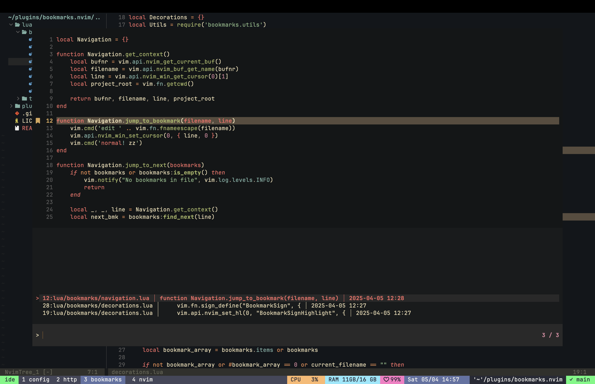
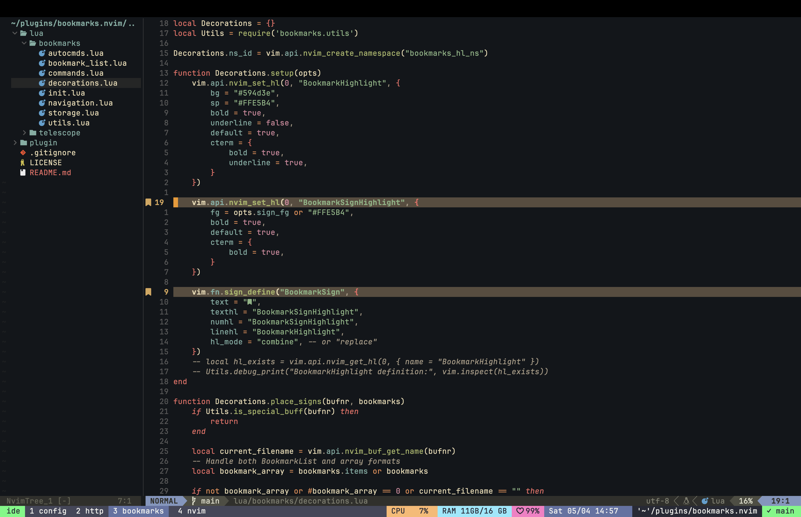

# bookmarks.nvim

A Neovim plugin for managing line bookmarks with Telescope integration and SQLite storage. Mark, organize, and quickly navigate between important locations in your codebase.



## Features

- 🔖 Add/remove bookmarks with visual indicators
- 🌟 Line highlighting for bookmarked lines
- 🚀 Fast SQLite-based persistent storage
- 🔍 Telescope integration for browsing and searching bookmarks
- ⌨️ Intuitive default keymaps
- 🔎 Fuzzy search through bookmarks by filename or content
- ⚡ Async file preview loading
- 🧭 Next/Previous bookmark navigation within files
- 🎯 Jump directly to bookmarked locations

## `bookmarks.nvim` vs. Native Vim Marks

While Vim's native marks (`ma`, `'a`) are useful for temporary navigation, `bookmarks.nvim` provides a more robust, feature-rich, and persistent bookmarking system.

| Feature         | Native Vim Marks                                   | `bookmarks.nvim`                                                                                          |
|-----------------|----------------------------------------------------|-----------------------------------------------------------------------------------------------------------|
| **Storage**     | Plain text (`.viminfo`/`shada`)                    | **SQLite Database** for structured, queryable, and persistent storage                                     |
| **Scope**       | Local (per-file) or Global (cross-file)            | **Project-aware**: Bookmarks are tied to a project root                                                   |
| **Data**        | File path, line, and column only                    | **Rich metadata**: line content, timestamp, project info                                                  |
| **UI**          | Command-based (`:marks`)                            | **Interactive UI**: Telescope integration for fuzzy search, browsing, and live previews                   |
| **Persistence** | Only global marks (`A-Z`) persist across sessions   | **All bookmarks are persistent** by default                                                               |
| **Management**  | Manual, must remember mark letters                  | **Centralized API**: Add, remove, list, and navigate bookmarks                                            |
| **Dependencies**| None (core feature)                                 | Requires [sqlite.lua](https://github.com/kkharji/sqlite.lua) and [telescope.nvim](https://github.com/nvim-telescope/telescope.nvim) |

## Requirements

- Neovim >= 0.7.0
- [sqlite.lua](https://github.com/kkharji/sqlite.lua)
- [telescope.nvim](https://github.com/nvim-telescope/telescope.nvim)

## Installation

Using `lazy.nvim`:

```lua
{
    "heilgar/bookmarks.nvim",
    dependencies = {
        "kkharji/sqlite.lua",
        "nvim-telescope/telescope.nvim",
        "nvim-lua/plenary.nvim",
    },
    config = function()
        require("bookmarks").setup({
            -- your configuration comes here
            -- or leave empty to use defaults
            default_mappings = true,
            db_path = vim.fn.stdpath('data') .. '/bookmarks.db'
        })
        require("telescope").load_extension("bookmarks")
    end,
    cmd = {
        "BookmarkAdd",
        "BookmarkRemove",
        "Bookmarks"
    },
    keys = {
        { "<leader>ba", "<cmd>BookmarkAdd<cr>", desc = "Add Bookmark" },
        { "<leader>br", "<cmd>BookmarkRemove<cr>", desc = "Remove Bookmark" },
        { "<leader>bj", desc = "Jump to Next Bookmark" },
        { "<leader>bk", desc = "Jump to Previous Bookmark" },
        { "<leader>bl", "<cmd>Bookmarks<cr>", desc = "List Bookmarks" },
    },
}
```

## Configuration

```lua
require("bookmarks").setup({
    -- Storage configuration
    db_path = vim.fn.stdpath('data') .. '/bookmarks.db',  -- Path to SQLite database

    -- Keymaps configuration
    default_mappings = true,  -- Set to false to disable default keymaps

    -- Custom mappings example (if default_mappings = false):
    mappings = {
        add = "ma",          -- Add bookmark at current line
        delete = "md",       -- Delete bookmark at current line
        list = "ml",         -- List all bookmarks
    }
})
```

## Usage

### Commands

- `:BookmarkAdd` - Add bookmark at current line
- `:BookmarkRemove` - Remove bookmark at current line
- `:Bookmarks` - Open Telescope to browse bookmarks

### Default Keymaps

- `<leader>ba` - Add bookmark
- `<leader>br` - Remove bookmark
- `<leader>bj` - Jump to next bookmark in file
- `<leader>bk` - Jump to previous bookmark in file
- `<leader>bl` - List bookmarks (opens Telescope)

Inside Telescope bookmarks view:
- `<CR>` - Jump to selected bookmark
- `<Del>` - Delete selected bookmark

To disable default keymaps, set `default_mappings = false` in setup and define your own:

```lua
vim.keymap.set('n', '<your-keymap>', require('bookmarks').add_bookmark)
vim.keymap.set('n', '<your-keymap>', require('bookmarks').remove_bookmark)
vim.keymap.set('n', '<your-keymap>', require('bookmarks').jump_to_next)
vim.keymap.set('n', '<your-keymap>', require('bookmarks').jump_to_prev)
vim.keymap.set('n', '<your-keymap>', require('telescope').extensions.bookmarks.list)
```

### Appearance

The plugin defines these highlight groups that you can customize:

- `BookmarkHighlight` - Highlight for bookmarked lines
- `BookmarkSignHighlight` - Highlight for the bookmark sign column indicator

Example of customizing highlights:

```lua
vim.api.nvim_set_hl(0, "BookmarkHighlight", {
    bg = "#3a3a3a",
    underline = true
})

vim.api.nvim_set_hl(0, "BookmarkSignHighlight", {
    fg = "#458588",
})
```

## API

```lua
local bookmarks = require("bookmarks")

-- Add bookmark at current line
bookmarks.add_bookmark()

-- Remove bookmark at current line
bookmarks.remove_bookmark()

-- Navigate bookmarks in current file
bookmarks.jump_to_next()
bookmarks.jump_to_prev()

-- Jump to a specific bookmark
bookmarks.jump_to_bookmark(filename, line_number)

-- Get all bookmarks
local storage = require("bookmarks.storage")
local all_bookmarks = storage.get_bookmarks()

-- Get bookmarks for specific file
local file_bookmarks = storage.get_file_bookmarks(filename)
```

## Contributing

Contributions are welcome! Please feel free to submit a Pull Request.

## Acknowledgments

Thanks to:
- [telescope.nvim](https://github.com/nvim-telescope/telescope.nvim) for the fuzzy finder interface
- [sqlite.lua](https://github.com/kkharji/sqlite.lua) for SQLite integration

## Screenshots

### Bookmark Preview



Search for bookmarks by filename, content, or line number directly from the search prompt.
The UI is designed for maximum readability with clear visual separation between entries.

The bookmarks viewer features a vertical layout with:
- File preview at the top, with syntax highlighting and a visual indicator for the bookmarked line
- Bookmark list in the middle showing line numbers, filenames, and bookmark content
- Search prompt at the bottom for quick filtering

